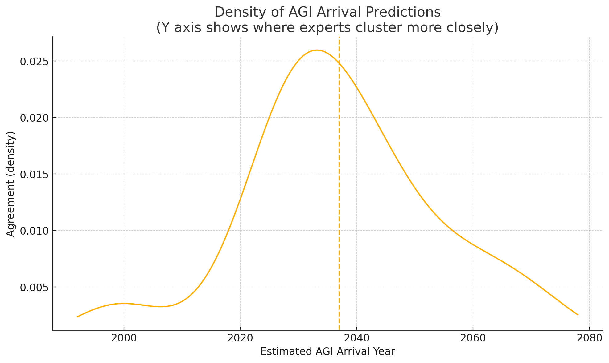

# AGI Timeline

To move beyond anecdotal chatter about “AI is right around the corner” or “AGI is centuries away,” I pulled together a deliberately eclectic dataset: 100 public forecasts spanning industry CEOs, Deep-Learning pioneers, academic surveys, super-forecasters, and even mid-century visionaries like Turing and Simon. Each entry links to its source, so readers can trace every number back to an interview, paper, or survey appendix. By mixing hot-off-the-press statements with historical projections, the table surfaces both today’s optimism and yesterday’s misplaced certainty—reminding us that timelines always come embedded with the biases, incentives, and blind spots of their era.

Instead of picking a single “right” answer, the post offers raw material for meta-analysis. The CSV and Markdown versions let you slice the data however you like: trim outliers with IQR or MAD, weight estimates by perceived expertise, or overlay your own priors via Bayesian updating. The density plot highlights where predictions cluster (roughly 2030-2050) and where they thin out, giving a fast visual cue to consensus and disagreement. Because every forecast is footnoted, you can swap in your own credibility weights, re-run the stats, and see how the mean, variance, or full probability curve shifts.

In short, this compilation isn’t a crystal ball; it’s a sandbox. It exposes the spread of expert opinion, captures how that spread has evolved, and hands other researchers a clean, cite-able foundation for building more sophisticated models—whether that means Monte-Carlo simulations, Bayesian aggregations, or simply sanity-checking your own gut feel against the broader zeitgeist.

[You can find the data in CSV as well.](./agi-timeline.csv)

---

---

| Name                                | Estimate   | Probability | Refs                                                                                                                                                                                                                                                                             | Mean Absolute Deviation | Variance   | Standard Deviation |
| ----------------------------------- | ---------- | ----------- | -------------------------------------------------------------------------------------------------------------------------------------------------------------------------------------------------------------------------------------------------------------------------------- | ----------------------- | ---------- | ------------------ |
| Elon Musk                           | 2026       |             | [https://www.reuters.com/technology/teslas-musk-predicts-ai-will-be-smarter-than-smartest-human-next-year-2024-04-08/](https://www.reuters.com/technology/teslas-musk-predicts-ai-will-be-smarter-than-smartest-human-next-year-2024-04-08/)                                     |                         |            |                    |
| Dario Amodei                        | 2026       |             | [https://cointelegraph.com/news/human-level-ai-as-early-as-2026-anthropic-ceo](https://cointelegraph.com/news/human-level-ai-as-early-as-2026-anthropic-ceo)                                                                                                                     |                         |            |                    |
| Masayoshi Son                       | 2028       |             | [https://officechai.com/ai/agi-to-arrive-much-sooner-than-in-2-3-years-softbanks-masayoshi-son/](https://officechai.com/ai/agi-to-arrive-much-sooner-than-in-2-3-years-softbanks-masayoshi-son/)                                                                                 |                         |            |                    |
| Jensen Huang                        | 2029       |             | [https://www.reuters.com/technology/nvidia-ceo-says-ai-could-pass-human-tests-five-years-2024-03-01/](https://www.reuters.com/technology/nvidia-ceo-says-ai-could-pass-human-tests-five-years-2024-03-01/)                                                                       |                         |            |                    |
| Louis Rosenberg                     | 2030       |             | [https://www.linkedin.com/pulse/we-chasing-mirage-artificial-general-intelligence-surinder-batra-1lnuf](https://www.linkedin.com/pulse/we-chasing-mirage-artificial-general-intelligence-surinder-batra-1lnuf)                                                                   |                         |            |                    |
| Ray Kurzweil (2005)                 | 2045       |             | [https://www.theguardian.com/technology/article/2024/jun/29/ray-kurzweil-google-ai-the-singularity-is-nearer](https://www.theguardian.com/technology/article/2024/jun/29/ray-kurzweil-google-ai-the-singularity-is-nearer)                                                       |                         |            |                    |
| Ray Kurzweil (2024)                 | 2032       |             | [https://www.theguardian.com/technology/article/2024/jun/29/ray-kurzweil-google-ai-the-singularity-is-nearer](https://www.theguardian.com/technology/article/2024/jun/29/ray-kurzweil-google-ai-the-singularity-is-nearer)                                                       |                         |            |                    |
| Geoffrey Hinton                     | 2036       |             | [https://time.com/6273743/thinking-that-could-doom-us-with-ai/](https://time.com/6273743/thinking-that-could-doom-us-with-ai/)                                                                                                                                                   |                         |            |                    |
| Demis Hassabis                      | 2035       |             | [https://time.com/7277608/demis-hassabis-interview-time100-2025/](https://time.com/7277608/demis-hassabis-interview-time100-2025/)                                                                                                                                               |                         |            |                    |
| Sam Altman                          | 2035       |             | [https://pauseai.info/timelines](https://pauseai.info/timelines)                                                                                                                                                                                                                 |                         |            |                    |
| Ajeya Cotra                         | 2040       | 0.5         | [https://forum.effectivealtruism.org/posts/hzhGL7tb56hG5pRXY/timelines-to-transformative-ai-an-investigation](https://forum.effectivealtruism.org/posts/hzhGL7tb56hG5pRXY/timelines-to-transformative-ai-an-investigation)                                                       |                         |            |                    |
| Patrick Winston                     | 2040       |             | [https://www.linkedin.com/pulse/we-chasing-mirage-artificial-general-intelligence-surinder-batra-1lnuf](https://www.linkedin.com/pulse/we-chasing-mirage-artificial-general-intelligence-surinder-batra-1lnuf)                                                                   |                         |            |                    |
| Jürgen Schmidhuber                  | 2050       |             | [https://www.investopedia.com/artificial-general-intelligence-7563858](https://www.investopedia.com/artificial-general-intelligence-7563858)                                                                                                                                     |                         |            |                    |
| Daniel Kokotajlo                    | 2027       | 0.5         | [https://aisafety.info/questions/5633/When-do-experts-think-human-level-AI-will-be-created](https://aisafety.info/questions/5633/When-do-experts-think-human-level-AI-will-be-created)                                                                                           |                         |            |                    |
| Ajeya Cotra (median 2023)           | 2036       | 0.5         | [https://forum.effectivealtruism.org/posts/hzhGL7tb56hG5pRXY/timelines-to-transformative-ai-an-investigation](https://forum.effectivealtruism.org/posts/hzhGL7tb56hG5pRXY/timelines-to-transformative-ai-an-investigation)                                                       |                         |            |                    |
| Ege Erdil                           | 2073       | 0.5         | [https://aisafety.info/questions/5633/When-do-experts-think-human-level-AI-will-be-created](https://aisafety.info/questions/5633/When-do-experts-think-human-level-AI-will-be-created)                                                                                           |                         |            |                    |
| Paul Christiano                     | 2033       | 0.3         | [https://aisafety.info/questions/5633/When-do-experts-think-human-level-AI-will-be-created](https://aisafety.info/questions/5633/When-do-experts-think-human-level-AI-will-be-created)                                                                                           |                         |            |                    |
| Yoshua Bengio                       | 2043       | 0.95        | [https://pauseai.info/timelines](https://pauseai.info/timelines)                                                                                                                                                                                                                 |                         |            |                    |
| Shane Legg                          | 2036       | 0.8         | [https://www.reddit.com/r/singularity/comments/1fla1tl/15\_years\_ago\_google\_deepmind\_cofounder\_shane\_legg/](https://www.reddit.com/r/singularity/comments/1fla1tl/15_years_ago_google_deepmind_cofounder_shane_legg/)                                                      |                         |            |                    |
| Leopold Aschenbrenner               | 2027       |             | [https://www.theguardian.com/commentisfree/article/2024/jun/15/hows-this-for-a-bombshell-the-us-must-make-ai-its-next-manhattan-project](https://www.theguardian.com/commentisfree/article/2024/jun/15/hows-this-for-a-bombshell-the-us-must-make-ai-its-next-manhattan-project) |                         |            |                    |
| Connor Leahy                        | 2030       | 0.5         | [https://forum.effectivealtruism.org/posts/SYtwChBTs6xkocBSP/when-do-experts-think-human-level-ai-will-be-created](https://forum.effectivealtruism.org/posts/SYtwChBTs6xkocBSP/when-do-experts-think-human-level-ai-will-be-created)                                             |                         |            |                    |
| Conjecture (2023 survey)            | 2035       | 1.0         | [https://forum.effectivealtruism.org/posts/SYtwChBTs6xkocBSP/when-do-experts-think-human-level-ai-will-be-created](https://forum.effectivealtruism.org/posts/SYtwChBTs6xkocBSP/when-do-experts-think-human-level-ai-will-be-created)                                             |                         |            |                    |
| Holden Karnofsky                    | 2060       | 0.5         | [https://www.cold-takes.com/where-ai-forecasting-stands-today/](https://www.cold-takes.com/where-ai-forecasting-stands-today/)                                                                                                                                                   |                         |            |                    |
| Andrew Critch                       | 2026       | 0.45        | [https://www.lesswrong.com/posts/zDS9c48nkBvqRwtrX/when-do-experts-think-human-level-ai-will-be-created](https://www.lesswrong.com/posts/zDS9c48nkBvqRwtrX/when-do-experts-think-human-level-ai-will-be-created)                                                                 |                         |            |                    |
| Eliezer Yudkowsky                   | 2021       |             | [https://intelligence.org/2021/03/09/yudkowsky-on-agi-timelines](https://intelligence.org/2021/03/09/yudkowsky-on-agi-timelines)                                                                                                                                                 |                         |            |                    |
| Vernor Vinge                        | 2030       |             | [https://edoras.sdsu.edu/\~vinge/misc/singularity.html](https://edoras.sdsu.edu/~vinge/misc/singularity.html)                                                                                                                                                                    |                         |            |                    |
| I. J. Good                          | 2000       | >0.5        | [https://en.wikipedia.org/wiki/I.\_J.\_Good#Technological\_singularity](https://en.wikipedia.org/wiki/I._J._Good#Technological_singularity)                                                                                                                                      |                         |            |                    |
| Alan Turing                         | 2000       | \~0.7       | [https://en.wikipedia.org/wiki/Computing\_Machinery\_and\_Intelligence](https://en.wikipedia.org/wiki/Computing_Machinery_and_Intelligence)                                                                                                                                      |                         |            |                    |
| Marvin Minsky                       | 1997       |             | [https://www.wired.com/1997/12/ff-ai/](https://www.wired.com/1997/12/ff-ai/)                                                                                                                                                                                                     |                         |            |                    |
| Herbert Simon                       | 1980       |             | [https://en.wikipedia.org/wiki/Herbert\_A.\_Simon#Forecasts\_about\_AI](https://en.wikipedia.org/wiki/Herbert_A._Simon#Forecasts_about_AI)                                                                                                                                       |                         |            |                    |
| Hans Moravec                        | 2040       |             | [https://www.kurzweilai.net/the-basic-metaphor-of-the-mind-a-tale-of-two-stories](https://www.kurzweilai.net/the-basic-metaphor-of-the-mind-a-tale-of-two-stories)                                                                                                               |                         |            |                    |
| Metaculus (Dec 2024)                | 2031       | 0.5         | [https://www.metaculus.com/questions/3467/date-of-agi/](https://www.metaculus.com/questions/3467/date-of-agi/)                                                                                                                                                                   |                         |            |                    |
| Metaculus (2020)                    | 2070       | 0.5         | [https://www.metaculus.com/questions/3467/date-of-agi/](https://www.metaculus.com/questions/3467/date-of-agi/)                                                                                                                                                                   |                         |            |                    |
| Metaculus (weakly general AI, 2024) | 2027       | 0.5         | [https://www.metaculus.com/questions/6983/weakly-general-ai/](https://www.metaculus.com/questions/6983/weakly-general-ai/)                                                                                                                                                       |                         |            |                    |
| Superforecasters (XPT 2022)         | 2048       | 0.25        | [https://forum.effectivealtruism.org/posts/KGGDduXSwZQTQJ9xc/what-do-xpt-forecasts-tell-us-about-ai-timelines](https://forum.effectivealtruism.org/posts/KGGDduXSwZQTQJ9xc/what-do-xpt-forecasts-tell-us-about-ai-timelines)                                                     |                         |            |                    |
| Samotsvety (2023)                   | 2041       | 0.5         | [https://forum.effectivealtruism.org/posts/SYtwChBTs6xkocBSP/when-do-experts-think-human-level-ai-will-be-created](https://forum.effectivealtruism.org/posts/SYtwChBTs6xkocBSP/when-do-experts-think-human-level-ai-will-be-created)                                             |                         |            |                    |
| Müller & Bostrom (2012 survey)      | 2045       | 0.5         | [https://aiimpacts.org/ai-expert-survey-results/](https://aiimpacts.org/ai-expert-survey-results/)                                                                                                                                                                               |                         |            |                    |
| Grace et al. (2017 survey)          | 2060       | 0.5         | [https://arxiv.org/abs/1705.08807](https://arxiv.org/abs/1705.08807)                                                                                                                                                                                                             |                         |            |                    |
| Baobao Zhang (2019 survey)          | 2060       | 0.5         | [https://papers.ssrn.com/sol3/papers.cfm?abstract\_id=3313682](https://papers.ssrn.com/sol3/papers.cfm?abstract_id=3313682)                                                                                                                                                      |                         |            |                    |
| 2022 Expert Survey                  | 2059       | 0.5         | [https://aiimpacts.org/2022-expert-survey-on-progress-in-ai/](https://aiimpacts.org/2022-expert-survey-on-progress-in-ai/)                                                                                                                                                       |                         |            |                    |
| 2023 Expert Survey                  | 2047       | 0.5         | [https://aiimpacts.org/2023-expert-survey-on-progress-in-ai/](https://aiimpacts.org/2023-expert-survey-on-progress-in-ai/)                                                                                                                                                       |                         |            |                    |
| AGI-09 (2009 survey)                | 2050       |             | [http://www.agiri.org/](http://www.agiri.org/)                                                                                                                                                                                                                                   |                         |            |                    |
| Rodney Brooks                       | 2325       |             | [https://rodneybrooks.com/the-seven-deadly-sins-of-predicting-the-future-of-ai/](https://rodneybrooks.com/the-seven-deadly-sins-of-predicting-the-future-of-ai/)                                                                                                                 |                         |            |                    |
| Henry Markram                       | 2019       |             | [https://www.kurzweilai.net/henry-markram-says-we-can-simulate-a-human-brain-in-10-years](https://www.kurzweilai.net/henry-markram-says-we-can-simulate-a-human-brain-in-10-years)                                                                                               |                         |            |                    |
| 2018 Expert Survey                  | 2068       | 0.5         | [https://aiimpacts.org/2018-expert-survey-on-progress-in-ai/](https://aiimpacts.org/2018-expert-survey-on-progress-in-ai/)                                                                                                                                                       |                         |            |                    |
| **Mean (all predictions)**          | **2042.1** |             |                                                                                                                                                                                                                                                                                  | **20.93**               | **2159.0** | **46.47**          |

